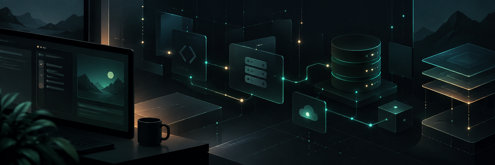

  

<h1 align="center">Arturo Santana</h1>
<h3 align="center">Full-Stack Developer</h3>

  <strong>Angular &bull; NestJS &bull; TypeScript &bull; Prisma &bull; PostgreSQL</strong>

  Building modern web applications, authentication systems, backend APIs, and software for engineering and laboratory workflows.

  <a href="https://github.com/soysantana">GitHub</a>
  &bull;
  <a href="https://www.linkedin.com/in/arturo-jose-santana-garcia-6b86b7279">LinkedIn</a>

## About Me

I am a full-stack developer focused on practical web applications with Angular, TypeScript, NestJS, Node.js, Prisma, and relational databases. I am especially interested in backend architecture, authentication and authorization, security-minded development, database design, and tools for engineering or laboratory environments.

I use GitHub as a place to build, learn in public, improve my projects, and grow through useful Pull Requests, Issues, and Code Reviews.

## Tech Stack

**Frontend**

**Backend**

**Databases**

**DevOps / Tools**

**Other**

## Featured Projects

**QA-LAB-APP**

Quality assurance and laboratory-oriented application concept focused on structured workflows, testable interfaces, and reliable data handling.

Stack: Angular, TypeScript, NestJS, Prisma, PostgreSQL.

**[AutHub](https://github.com/soysantana/AutHub)**

Authentication and authorization project for exploring secure backend patterns and identity flows.

Stack: TypeScript, NestJS, Node.js.

**PVDJ Soil Lab / Laboratory Platform**

New laboratory platform idea for soil and engineering workflows, with attention to traceable records, database design, and production-ready architecture.

Stack: Angular, NestJS, TypeScript, Prisma, PostgreSQL.

## GitHub Analytics

  

## Most Used Languages

These language stats reflect public repository usage, not skill level.

  

## GitHub Streak

  

## GitHub Trophies

  

## Contribution Activity Graph

  

## Contribution Snake

  <picture>
    <source media="(prefers-color-scheme: dark)" srcset="https://raw.githubusercontent.com/soysantana/soysantana/output/github-contribution-grid-snake-dark.svg" />
    <source media="(prefers-color-scheme: light)" srcset="https://raw.githubusercontent.com/soysantana/soysantana/output/github-contribution-grid-snake.svg" />
    
  </picture>

## Current Focus

Angular, NestJS, TypeScript, backend architecture, authentication and authorization, PostgreSQL, and open source collaboration.

## GitHub Goals

- Make useful open source contributions.
- Create Pull Requests that improve real projects.
- Practice thoughtful Code Reviews.
- Improve testing habits and coverage.
- Build cleaner CI/CD workflows.
- Strengthen backend architecture decisions.
- Ship production-ready applications with maintainable foundations.

## Contact

- GitHub: [@soysantana](https://github.com/soysantana)
- LinkedIn: [Arturo Jose Santana Garcia](https://www.linkedin.com/in/arturo-jose-santana-garcia-6b86b7279)
